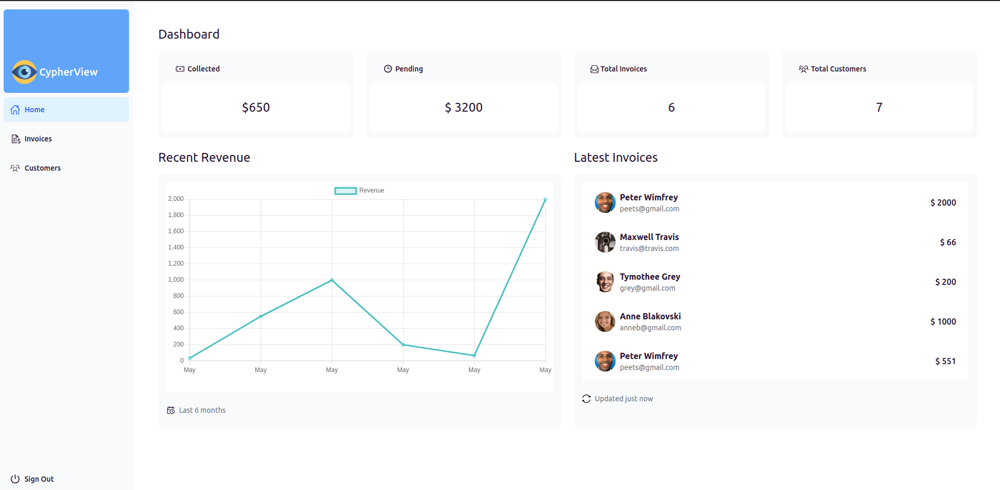
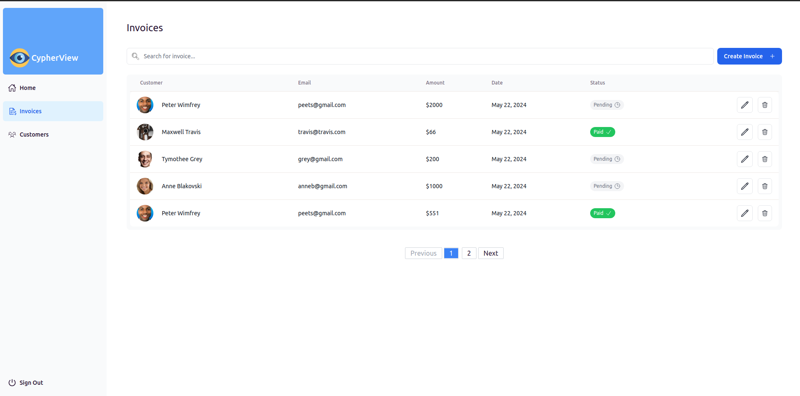
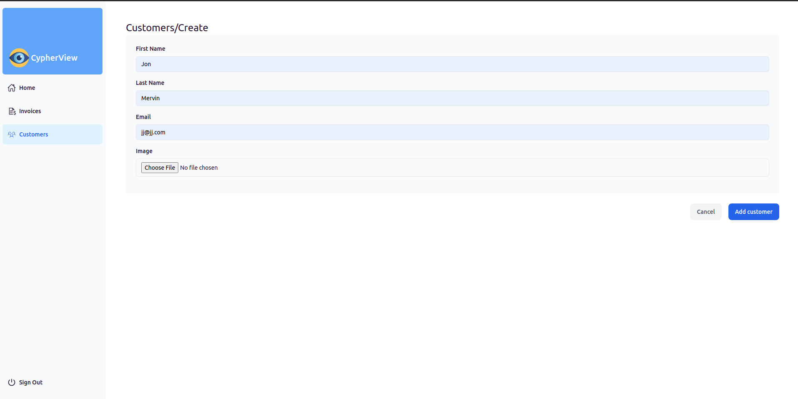
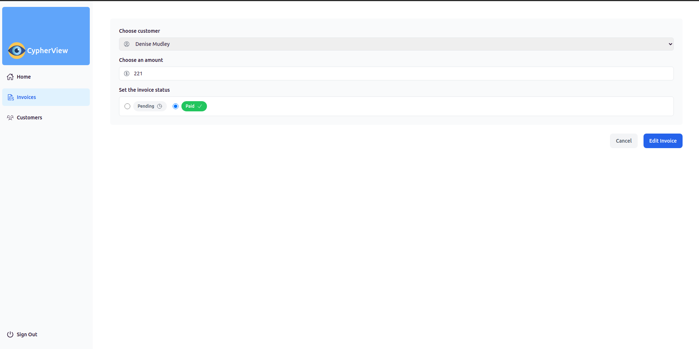

# CypherView Dashboard

This is a full-stack Invoice Management System built with React, TypeScript, Express, MongoDB Atlas, and TailwindCSS for managing invoices and customers. It allows users to view the total collected amount, pending amount, total invoices, and total customers.
The application also has a demo login user with limited authorization.

Live demo [HERE](https://stefanpython.github.io/cypherView-dashboard/)

## Features

- View total collected amount
- View pending amount
- View total number of invoices
- View total number of customers
- Add/Edit/Delete invoices
- Add/Edit/Delete customers
- Responsive design

## Technologies Used

- Frontend:

  - React
  - TypeScript
  - TailwindCSS
  - React Icons
  - React Loading Skeleton
  - DaisyUI

- Backend:

  - Express
  - MongoDB Atlas
  - JavaScript

- Authentication:
  - JSON Web Tokens (JWT)

## Installation

Prerequisites:

- Node.js
- npm
- MongoDB Atlas account

Frontend Setup:

1. Clone the repository:
   $ git clone https://github.com/stefanpython/cypherView-dashboard.git

2. Navigate into the frontend directory:
   $ cd cypherView-dashboard/client

3. Install dependencies:
   $ npm install

4. Start the development server:
   $ npm start

5. Open your browser and go to http://localhost:5173 to view the application.

Backend Setup:

1. Navigate into the backend directory:
   $ cd cypherView-dashboard/server

2. Install dependencies:
   $ npm install

3. Set up environment variables:
   Create a .env file in the backend directory and add the following:

   MONGODB_URI=mongodb_link_here
   PASSPORT_KEY=your_jwt_secret

4. Start the backend server:
   $ npm start

5. The backend server will start on http://localhost:3000.

## API Endpoints

The backend provides the following API endpoints:

User Routes:

- POST /sign-up: Sign up a new user
- POST /login: Login an existing user
- GET /user/:userId: Get details of a user (requires authentication)
- POST /demo-login: Login a demo user

Customer Routes:

- POST /customers: Create a new customer
- GET /customers/:customerId: Get details of a customer
- GET /customers: Get list of all customers (requires authentication)
- PUT /customers/:customerId: Update a customer (requires authentication)
- DELETE /customers/:customerId: Delete a customer (requires authentication)

Invoice Routes:

- GET /invoices/total-collected: Get total collected amount (requires authentication)
- GET /invoices/total-pending: Get total pending amount (requires authentication)
- POST /invoices: Create a new invoice (requires authentication)
- GET /invoices: Get list of all invoices (requires authentication)
- GET /invoices/:invoiceId: Get details of an invoice (requires authentication)
- PUT /invoices/:invoiceId: Update an invoice (requires authentication)
- DELETE /invoices/:invoiceId: Delete an invoice (requires authentication)

## Usage

- Upon launching the application, you will see the total collected amount, pending amount, total number of invoices, and total number of customers.
- If the data is still loading, loading skeletons will be displayed.
- You can click on each card to view more details or navigate to specific sections for detailed information.

## Development

Frontend:
The frontend is built using React, TypeScript, and TailwindCSS. It includes various components such as CustomersTable and CardWrapper to display customer and invoice data.

Backend:
The backend is built using Express and JavaScript. It connects to a MongoDB Atlas database to store customer and invoice data. The backend also handles authentication using JWT.

## License

This project is licensed under the MIT License - see the LICENSE file for details.
